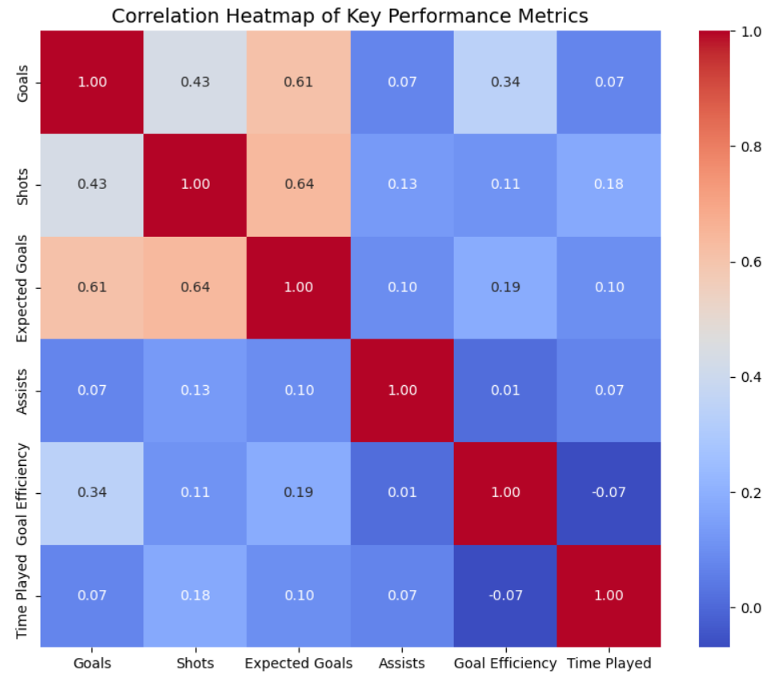

# 📊 Football Player Performance Analysis (2014–2020)

---

## 📝 Project Summary
This project analyzes football player performance data from 2014–2020.  
Using Python and exploratory data analysis (EDA), the project uncovers insights on scoring patterns, assists, discipline, playing time, and performance efficiency.  
Engineered features such as **Goal Efficiency** and **xG Difference** help highlight key players and trends across different positions.

---

## 📌 Table of Contents
- [Project Scope](#-project-scope)
- [Data Cleaning Summary](#-data-cleaning-summary)
- [Repository Structure](#-repository-structure)
- [Visualizations](#-visualizations)
- [Key Findings](#-key-findings)
- [Tools Used](#-tools-used)

---

## 🚀 Project Scope

- Clean and prepare large CSV datasets for analysis  
- Merge player information and match appearances  
- Handle missing values and fix inconsistencies  
- Engineer new features (Goal Efficiency, xG Difference)  
- Create meaningful visualizations  
- Generate insights useful for coaches, analysts, and scouts  

---

## 🧹 Data Cleaning Summary

- Removed unnecessary columns  
- Handled missing values  
- Converted incorrect data types  
- Removed invalid ranges  
- Standardized player positions  
- Created new metrics (Goal Efficiency, xG Difference)  

---

## 📁 Repository Structure

football-player-performance-analysis/

│

├── data/

├── notebooks/

├── visuals/

└── README.md

---

## 📈 Visualizations

### 🔥 Goals & Assists by Position

### 🏆 Top 10 Goal Scorers

### 📊 Heatmap — Behind Every Goal

### 🟥🟨 Discipline

### ⏱️ Who Works the Longest?

---

## 💡 Key Findings

- Forwards are the biggest scoring contributors  
- Midfielders provide the most assists and playmaking value  
- Defenders have the highest discipline issues  
- Playing time heavily influences total goals  
- Higher shots and xG correlate strongly with actual goals  

---

## 🛠 Tools Used

- Python  
- Pandas  
- Matplotlib  
- Jupyter Notebook 
